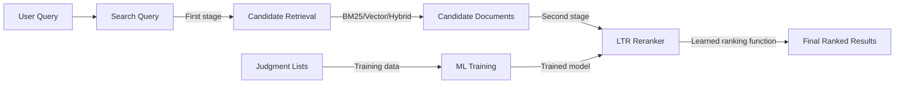

```mermaid
flowchart LR
    U[User Query] --> Q[Search Query]

    Q -->|First stage| R[Candidate Retrieval]
    R -->|BM25/Vector/Hybrid| D[Candidate Documents]

    D -->|Second stage| LTR[LTR Reranker]
    LTR -->|Learned ranking function| F[Final Ranked Results]

    JL[Judgment Lists] -->|Training data| ML[ML Training]
    ML -->|Trained model| LTR
```